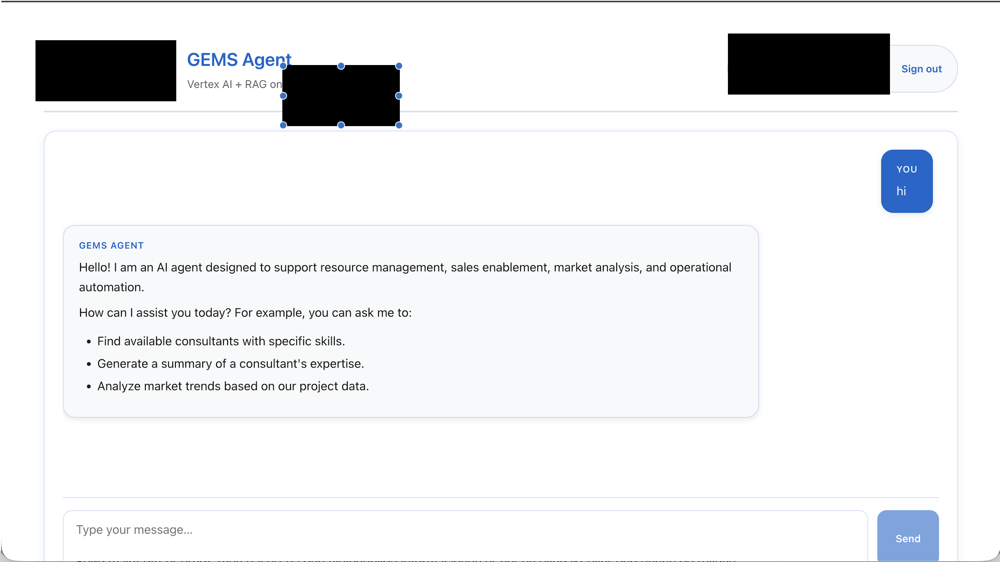

# GEMS Agent Chat UI

Frontend client for chatting with GEMS Agent powered by **Vertex AI RAG Engine**, **LangChain**, and **Fine-tuned Gemini Models** via Cloud Run API. The application is built with React + TypeScript + Vite and supports Google Workspace login to restrict usage to `@randstad.no` accounts.

The backend implements a LangChain-based RAG (Retrieval-Augmented Generation) workflow that combines Vertex AI Managed RAG Engine for document retrieval with fine-tuned Gemini models for generating standardized, business-aligned responses.

## What This Project Does

- Provides a web chatbot that answers business questions by grounding responses in your company documents.
- Uses Vertex AI Managed RAG to retrieve relevant context from a RAG Corpus.
- Uses LangChain to orchestrate retrieval → prompt assembly → fine-tuned Gemini generation.
- Enforces Google Workspace login (only `@randstad.no`) before allowing chat.
- Deploys as a single Cloud Run service (frontend + backend) behind one URL.

## Technology Overview

- **Frontend**: React + TypeScript + Vite; Google Identity Services for OAuth; domain check `@randstad.no`.
- **Backend**: FastAPI with LangChain LCEL pipeline; custom retriever (`VertexRAGEngineRetriever`) and custom LLM (`VertexCustomEndpoint`).
- **AI**: Vertex AI Managed RAG Engine (retrieval) + Fine-tuned Gemini (generation), with fallback to standard Gemini if fine-tuned is unavailable.
- **Infra**: Cloud Run for hosting; `.env` driven configuration; scripts for local/dev/prod workflows.

## Google Cloud Setup (Minimal Steps)

1) **Enable APIs**
   - Enable Vertex AI API, Cloud Run API, Artifact Registry API, Cloud Build API.

2) **Create a RAG Corpus**
   - In Vertex AI RAG, create a corpus and note `RAG_CORPUS_ID`.
   - Ingest documents (GCS, BigQuery, or direct upload) and build the index.

3) **Fine-tuned Gemini Model**
   - Fine-tune Gemini in Vertex AI; note `FINE_TUNED_MODEL_ID`.
   - (Optional) Deploy it to an endpoint; note `FINE_TUNED_ENDPOINT_ID`.

4) **Service Account and Permissions**
   - Create a service account for Cloud Run execution.
   - Grant: Vertex AI User, Storage Object Viewer (if using GCS), Artifact Registry Reader, Cloud Run Invoker (as needed).

5) **Configure Environment**
   - Set `GOOGLE_CLOUD_PROJECT`, `VERTEX_AI_LOCATION`, `RAG_CORPUS_ID`, `FINE_TUNED_MODEL_ID` (and optionally `FINE_TUNED_ENDPOINT_ID`), `VITE_GOOGLE_CLIENT_ID`.
   - Put backend vars in `backend/.env`; frontend vars in project root `.env`.

6) **Deploy**
   - From project root: `./deploy.sh` (builds frontend, packages backend, deploys to Cloud Run).
   - After deploy, use the Cloud Run URL as the chatbot base; ensure the allowed OAuth origin matches this URL.

## Quick Start

### Local Testing (Run Frontend and Backend Together)

```bash
# Run the startup script (automatically starts both frontend and backend)
./start.sh
```

Or start manually:

```bash
# Terminal 1: Start backend
cd backend
source venv/bin/activate
python main.py

# Terminal 2: Start frontend
npm install
npm run dev
```

Frontend runs on `http://localhost:3000`, backend runs on `http://localhost:8080`.

## Interface Example

The GEMS Agent Chat UI provides a clean, modern chat interface. Here's what it looks like:



### Chat Interface Layout

- **User Messages**: Displayed in blue rounded bubbles aligned to the right, labeled with "YOU"
- **Agent Messages**: Displayed in light grey rounded bubbles aligned to the left, labeled with "GEMS AGENT"
- **Message Input**: A text input field at the bottom with a "Send" button for submitting queries
- **Keyboard Support**: Press Enter to send, Shift+Enter for a new line

### Example Conversation

When you start a conversation, the GEMS Agent introduces itself with:

> "Hello! I am an AI agent designed to support resource management, sales enablement, market analysis, and operational automation. How can I assist you today? For example, you can ask me to:
> - Find available consultants with specific skills.
> - Generate a summary of a consultant's expertise.
> - Analyze market trends based on our project data."

The interface supports markdown rendering for agent responses, making it easy to display formatted text, lists, and structured information.

## Architecture & Technology Stack

### LangChain RAG Integration

The backend implements a **Retrieval-Augmented Generation (RAG)** workflow using the LangChain framework, combining:

1. **Custom Retriever** (`VertexRAGEngineRetriever`):
   - Integrates with Vertex AI Managed RAG Engine
   - Retrieves top-k relevant documents from the RAG Corpus based on user queries
   - Converts retrieved contexts into LangChain `Document` objects

2. **Custom LLM** (`VertexCustomEndpoint`):
   - Connects to your fine-tuned Gemini model deployed on Vertex AI Endpoint
   - Handles model invocation with proper input/output formatting
   - Supports dynamic model ID retrieval from endpoint configuration

3. **LangChain Expression Language (LCEL) Chain**:
   - Orchestrates the RAG workflow: `Retriever → Prompt Template → Fine-tuned LLM → Response`
   - Automatically combines retrieved context with user questions
   - Ensures responses are grounded in the retrieved documents

### Fine-Tuned Model Integration

The system prioritizes using your **fine-tuned Gemini model** for generation:

- **Benefits**: More standardized, business-aligned responses tailored to your domain
- **Configuration**: Set `FINE_TUNED_ENDPOINT_ID` and `FINE_TUNED_MODEL_ID` in environment variables
- **Fallback**: Automatically falls back to standard Gemini models if fine-tuned model is unavailable
- **Implementation**: Uses `vertexai.generative_models.GenerativeModel` for fine-tuned Gemini models

### LLM Integration Flow

```
User Query
    ↓
[LangChain RAG Chain]
    ├─→ Vertex AI RAG Engine (Retrieve relevant documents)
    ├─→ Build Enhanced Prompt (Context + Question)
    └─→ Fine-tuned Model Endpoint (Generate response)
    ↓
Response to User
```

**For Agent Self-Questions** (questions about the agent itself):
- Uses standard Gemini models with system instructions
- Skips RAG retrieval for efficiency
- Provides direct answers about agent capabilities

**For Company Data Questions**:
- Uses LangChain RAG Chain with fine-tuned model
- Retrieves relevant documents from RAG Corpus
- Generates context-aware responses using fine-tuned model

### Key Components

- **Frontend**: React + TypeScript + Vite
- **Backend**: FastAPI (Python)
- **RAG Engine**: Vertex AI Managed RAG
- **LLM Framework**: LangChain with custom components
- **Fine-tuned Model**: Vertex AI Fine-tuned Gemini
- **Authentication**: Google Workspace OAuth
- **Deployment**: Cloud Run (unified frontend + backend)

## Configuration

### Local Development

Create `.env` file (optional, to override defaults):

```
VITE_CHAT_API_URL=http://localhost:8080/chat   # Used for local development
VITE_GOOGLE_CLIENT_ID=YOUR_GOOGLE_OAUTH_CLIENT_ID
```

### Backend Configuration

Create `backend/.env` file:

```
# Required Configuration
GOOGLE_CLOUD_PROJECT=your-project-id
VERTEX_AI_LOCATION=europe-north1
RAG_CORPUS_ID=your-rag-corpus-id
PORT=8080

# Fine-tuned Model Configuration (Optional but Recommended)
FINE_TUNED_ENDPOINT_ID=your-endpoint-id
FINE_TUNED_MODEL_ID=your-model-id
USE_FINE_TUNED_MODEL=true

# Gemini Model Configuration (Optional)
GEMINI_MODEL=gemini-2.5-pro
```

**Note**: The system will automatically use LangChain RAG Chain with fine-tuned model if `FINE_TUNED_ENDPOINT_ID` is configured. Otherwise, it falls back to standard Gemini models.

## Deploy to Cloud Run

### Unified Deployment (Frontend and Backend Together)

```bash
# Run from project root directory
./deploy.sh
```

This will:
1. Build frontend static files
2. Create a Docker image containing both frontend and backend
3. Deploy to Cloud Run
4. Frontend and API are on the same service, accessible via a single URL

After deployment, everyone can access the application via the URL provided by Cloud Run.

## Features

- Chat interface with history, message bubbles for user/agent, and keyboard support (Enter to send, Shift+Enter for new line).
- Loading status and error handling when Cloud Run API responds slowly or is unreachable.
- Google Workspace login via `@randstad.no` check (ID token is decoded and email domain is verified).
- Custom status banner that reminds about missing configuration.

## Further Customization

- Update texts in `src/App.tsx` if you want more localized messages.
- Customize styling in `src/App.css` and global variables in `src/index.css`.
- Consider adding telemetry/logging when connecting the UI to production.
